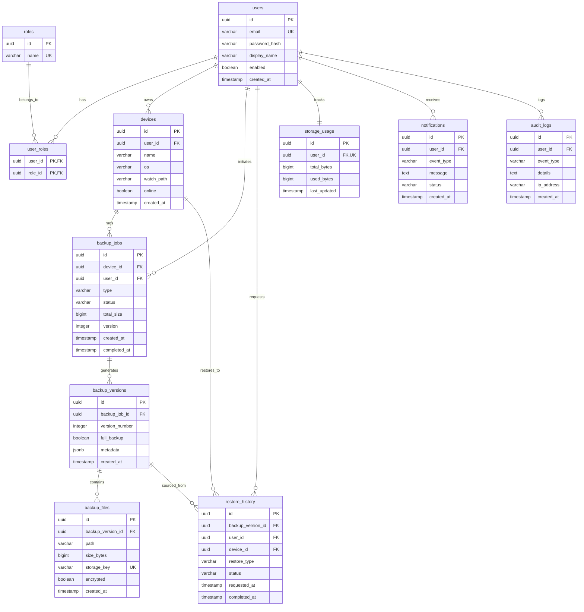

# Thiết kế Cơ sở Dữ liệu & Sơ đồ ERD

Thư mục này chứa toàn bộ thiết kế cơ sở dữ liệu quan hệ của hệ thống CloudSafe, bao gồm sơ đồ ERD tổng quan và đặc tả chi tiết của từng bảng dữ liệu được phân chia theo từng phân hệ chức năng.

---

## 1. Sơ đồ ERD tổng quan (Entity Relationship Diagram)

Sơ đồ dưới đây biểu diễn mối quan hệ giữa các thực thể trong cơ sở dữ liệu. Bạn có thể xem trực quan thông qua các trình đọc hỗ trợ Mermaid:

---

## 2. Danh mục tài liệu Đặc tả chi tiết các Bảng

Nhấp vào từng liên kết dưới đây để xem chi tiết schema, kiểu dữ liệu và mô tả các cột của từng bảng theo phân hệ:

*   🔑 **[Phân hệ Người dùng & Quyền truy cập](file:///c:/Users/N07/Documents/GitHub/cloud-backup-system/docs/erd/users.md)**: Đặc tả bảng `users`, `roles`, `user_roles`.
*   🖥️ **[Phân hệ Thiết bị máy khách](file:///c:/Users/N07/Documents/GitHub/cloud-backup-system/docs/erd/devices.md)**: Đặc tả bảng `devices`.
*   📁 **[Phân hệ Tiến trình Sao lưu](file:///c:/Users/N07/Documents/GitHub/cloud-backup-system/docs/erd/backups.md)**: Đặc tả bảng `backup_jobs`, `backup_versions`, `backup_files`.
*   🔄 **[Phân hệ Khôi phục dữ liệu](file:///c:/Users/N07/Documents/GitHub/cloud-backup-system/docs/erd/restores.md)**: Đặc tả bảng `restore_history`.
*   📊 **[Phân hệ Quản lý Dung lượng Cloud](file:///c:/Users/N07/Documents/GitHub/cloud-backup-system/docs/erd/storage.md)**: Đặc tả bảng `storage_usage`.
*   🔔 **[Phân hệ Cảnh báo & Thông báo](file:///c:/Users/N07/Documents/GitHub/cloud-backup-system/docs/erd/notifications.md)**: Đặc tả bảng `notifications`.
*   📝 **[Phân hệ Nhật ký Hệ thống](file:///c:/Users/N07/Documents/GitHub/cloud-backup-system/docs/erd/audit.md)**: Đặc tả bảng `audit_logs`.

---

## 3. Thiết kế Index (Tối ưu truy vấn)

Để đảm bảo hệ thống có tốc độ phản hồi nhanh khi khối lượng dữ liệu lưu trữ tăng cao, các chỉ mục (indexes) sau đây được thiết kế và áp dụng:

1.  **`idx_users_email`**: Index B-Tree trên `users(email)` để tăng tốc truy vấn khi đăng nhập tài khoản.
2.  **`idx_backup_files_version`**: Index B-Tree trên `backup_files(backup_version_id)` giúp truy xuất nhanh danh sách tệp của một phiên bản khi giải nén.
3.  **`idx_backup_files_key`**: Index B-Tree trên `backup_files(storage_key)` để kiểm tra nhanh sự tồn tại của file trên Storage Bucket.
4.  **`idx_backup_jobs_device`**: Index B-Tree trên `backup_jobs(device_id)` phục vụ lọc lịch sử sao lưu theo thiết bị cục bộ.
5.  **`idx_notifications_user`**: Index B-Tree trên `notifications(user_id, status)` giúp ứng dụng lấy nhanh danh sách thông báo chưa đọc cho User.
